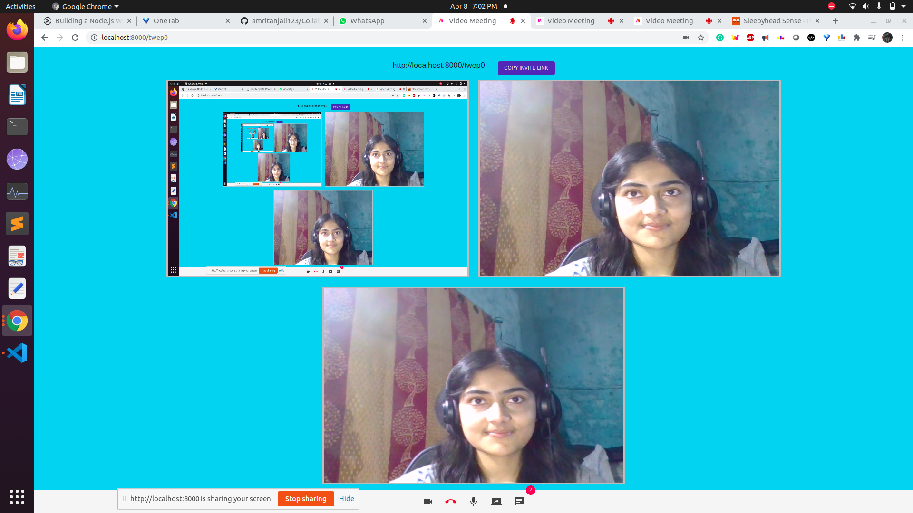
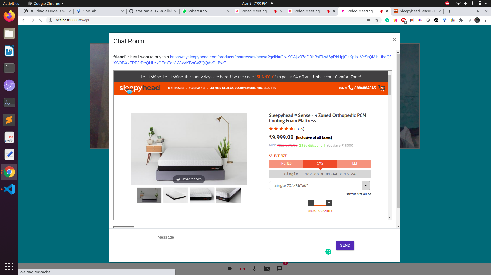

# Collaborative-Shopping

## THEME
One of the things that differs from online vs offline shopping experience is “shopping together”. This void of
company in online shopping can make it boring over a period of time. Ever wondered how collaborative
shopping can improve shopping experience? Imagine you get to seek your friend’s style tips/suggestions on
the go.
Let us break the traditional myths of e-commerce shopping and bring togetherness. We would call that
Collaborative online shopping. This term refers to an activity in which a consumer shops at an eCommerce
platform with remotely located shopping partners such as friends or family. This brings the best of both the
shopping worlds together.
## Demo 
https://www.youtube.com/watch?v=T1IzSwN8VYI
##

## How to Use: 
If a user wants to initiate a discussion, then he/she will have to click on – “Join the Room” button and
subsequently enter own name, then copy & share the generated link with friends. Once joined, the users
can discuss among the members of the group meet.
User can toggle audio, video, send the link of product via chat and share myntra page screen. User's friend can easly click on that link to open the product on which User wants to discuss and share their valuable feedback on the product.
user can open the product from chat room by just clicking on the link or user can see the product on the frame present inside the chat room.

## Dependency 
myntra can add a button on tha page by the name collobrate so that once user click on that they can divert to the given page that we have built. 
myntra Can add a button similar to add to cart by the name of move to discussion then link can autometically send to the chat room we can't able to add this feature because we dont have access of myntra page source code. 

### Please Use Google Chrome

 Use of Google Chrome is suggested as some of the features may or may not work on other browsers.
  
## Technology used

ReactJS, Node.js, SocketIO

## Features
- No account needed
- Unlimited users
- Messaging chat and video streaming in real-time
- Screen sharing to present Screen, web page, and more
- Everyting is peer-to-peer thanks to webrtc

## How to run

Local setup
1. yarn install
2. yarn dev
1) npm install (this will install all the package)
2) npm run-script dev(to host web page on localhost)
##     
   
Thank You!  0x5eba/Video-Meeting, React, webrtc, socketIO Documentation, W3School, Youtube for Helping. 
